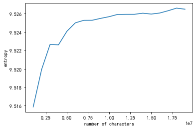

# 第一次大作业 - 网络文本信息熵分析


## 方法

### 爬取网页

通过下述方法实现：

```python
import requests

response = requests.get(url)
html_text = response.text
```

### 爬虫伪装

长时间抓取同一站点容易被反爬虫程序阻挡，从而断连。因此采用随机更换header的方式伪装。

```python
user_agent_list = [
    "Mozilla/4.0 (compatible; MSIE 6.0; Windows NT 5.1; SV1; AcooBrowser; .NET CLR 1.1.4322; .NET CLR 2.0.50727)",
    ...
    "Mozilla/5.0 (Windows NT 10.0; Win64; x64) AppleWebKit/537.36 (KHTML, like Gecko) Chrome/58.0.3029.110 Safari/537.36"   
]

def get_headers():
    headers['User-Agent'] = random.choice(user_agent_list)
    return headers

response = requests.get(url, headers=get_headers())
```

### 解析网页

由上一步得到的文本为html格式，文本中夹杂着大量代码片段，需要通过解析网页来提取其中的文本数据。我通过BeautifulSoup库实现。

```python
from bs4 import BeautifulSoup

def parse_html(html_text:str) -> str:
    soup = BeautifulSoup(html_text, 'html.parser')
    text = soup.get_text()
    return text
```

### 保存解析后的网页数据

为了得到大量样本，往往需要对多个网页进行爬取，耗时较长。因此我引入了保存数据的功能。具体逻辑如下：

```python
import os

def analyze_urls(urls:list, name:str, Chinese_only:bool=False, English_only:bool=False) -> None:
    print(name)

    text = ""
    if not os.path.exists(name+".txt"):
        for url in urls:
            print("爬取网页", url)
            response = requests.get(url)
            text += parse_html(response.text)

        with open(name+".txt", "w", encoding="utf-8") as f:
            f.write(text)
    
    with open(name+".txt", "r", encoding="utf-8") as f:
        # 若曾经抓取过该网页且缓存到本地，则使用本地历史数据
        text = f.read()
    
    analyze_text(text, Chinese_only, English_only)
```

当需要分析输入的网址列表中的多个网页上的文本数据时，上述算法将自动检查当前目录是否有同名文本——若有，则会使用本地历史数据。每次爬取网页后会自动将经解析的文本数据保存到本地，以供重复使用。

### 只保留对应语言的字符

原始经解析后的文本中往往带有大量标点、空格、换行符等字符。这些字符会影响最终的分析结果，应当被清洗删去。这里我通过正则匹配对中文和英语分别实现了该功能。

```python
import re

def delete_non_chinese(string:str) -> str:
    return re.sub(r'[^\u4e00-\u9fa5]','',string)

def delete_non_english(string:str) -> str:
    return re.sub(r'[^\u0041-\u005a\u0061-\u007a]','',string)

```

### 分析熵值

最后，使用Counter对经清洗后的文本进行统计，计算各自出现频率以及最后的熵。输出总字符数、不同字符数、TOP 10 字符机器出现频率、熵。

```python
import numpy as np
from collections import Counter

def analyze_entropy(string:str, print_info:bool=True) -> float:
    count = Counter(string)
    times = np.array(list(count.values()))
    proportion = times/np.sum(times)
    entropy = -np.sum(proportion*np.log2(proportion))

    if print_info:
        print("| 总字符数", np.sum(times))
        print("| 不同字符数", len(times))
        print("| TOP 10 字符及其出现频率")
        print("|", end=" ")
        for char, freq in count.most_common(10):
            print(char, round(freq/np.sum(times), 4), end=" ")
        print(" ")
        print("| 熵", entropy)
    return entropy
```

## 数据

### 单文本分析

我选取了三本书籍作为分析对象，分别为莎士比亚于1603年写的《哈姆雷特》，J.K.罗琳于1997写的《哈利·波特》的第一部，以及胡伟武老师刚出版的《计算机体系结构基础》第三版。前两段文本为英文，后一段为中文。所有书籍内容均爬取自网络。

### 多文本分析

来自单个文本的数据往往会带有语境的倾向性，因此基于单个文本的统计结果可能不具有普适性。同时，单个文本的数据量较少，也不足以支撑更多的分析。因此，我还结合了多个文本的数据，并进行了分析。这些数据来源于[古登堡计划](gutenberg.org)（英文）和[中文小说网站](https://www.555x.org)（中文）。

采集代码如下所示。当运行时，该程序段会不间断地随机挑选各自网站上的网页进行爬取，并将爬取到的文本内容按2M字节为单位保存到本地文件夹下。当采集数据达到目标值时，需要手动中断程序。

```python
# 中文文本收集
max_id = 20000
url = "https://www.555x.org"

while True:
    id = random.randint(100000,999999)
    print("文本号", id)
    word_count = 0
    with open("Chinese/"+str(id)+".txt", "w", encoding="utf-8") as f:
        while word_count<2000000:
            id = random.randint(1,max_id)
            try:
                response = requests.get(url+"/txt"+str(id)+".html", headers=get_headers())
            except Exception as e:
                print(e)
                continue
            soup = BeautifulSoup(response.text, "html.parser")
            for item in soup.find_all('a'):
                if item.get('href') and item.get('href').startswith("/read/"):
                    whole_url = url+item.get('href')
                    print("当前字数", word_count, "爬取网页", whole_url)
                    try:
                        response = requests.get(whole_url, headers=get_headers())
                    except Exception as e:
                        print(e)
                        continue
                    soup = BeautifulSoup(response.text, 'html.parser')
                    if soup.find_all(name="div",attrs={"id":"booktxt"}):
                        text = soup.find_all(name="div",attrs={"id":"booktxt"})[0].get_text()
                        text = delete_non_chinese(text)
                        f.write(text)
                        word_count += len(text)
```

```python
# 英文文本收集
max_id = 60000

while True:
    id = random.randint(100000,999999)
    print("文本号", id)
    word_count = 0
    with open("English/"+str(id)+".txt", "w", encoding="utf-8") as f:
        while word_count<2000000:
            id = random.randint(1,max_id)
            url = "https://www.gutenberg.org/files/%d/%d-h/%d-h.htm" % (id, id, id)
            print("当前字数", word_count, "爬取网页", url)
            try:
                response = requests.get(url)
            except Exception as e:
                print(e)
                continue
            text = delete_non_english(parse_html(response.text))
            f.write(text)
            word_count += len(text)
        
```

## 结果及分析

### 单文本分析

结果如下所示：

```txt
莎士比亚《哈姆雷特》1603 英语
只保留英文字母后
| 总字符数 149594
| 不同字符数 52
| TOP 10 字符及其出现频率
| e 0.1086 t 0.0829 o 0.0791 a 0.0653 n 0.0595 s 0.058 i 0.0568 r 0.0564 h 0.0551 l 0.0391  
| 熵 4.655863529271688
```
```txt
J.K.罗琳《哈利波特》1997 英语
只保留英文字母后
| 总字符数 352746
| 不同字符数 52
| TOP 10 字符及其出现频率
| e 0.1177 t 0.0835 o 0.0784 a 0.0766 r 0.0638 n 0.0636 h 0.0583 i 0.0573 s 0.0557 d 0.0463  
| 熵 4.452632877477386
```
```txt
胡伟武等《计算机体系结构基础》2022 中文
去除英文/数字/标点符号后
| 总字符数 236171
| 不同字符数 1510
| TOP 10 字符及其出现频率
| 的 0.0453 器 0.0151 存 0.0121 指 0.0108 一 0.0106 用 0.0106 行 0.0105 理 0.0103 数 0.0102 程 0.01  
| 熵 8.513406461425053
```

可以看到，中文文本的信息熵显著高于英文文本，这与课堂上的结论一致。同时，莎士比亚著作的熵略高于J.K.罗琳著作，猜测是因为不同年代的英语分布不同。

对于《计算机体系结构基础》一书，其信息熵相比课上介绍的结果（9.71）偏低，猜测是因为书中含有大量重复的专有名词，这些名词的出现拉低了熵值。另外书中出现频率最高的十个字符大都与“计算机”相关，这也是符合预期的。

### 多文本分析

中文文本的结果如下所示：

```txt
| 总字符数 19626942
| 不同字符数 5638
| TOP 10 字符及其出现频率
| 的 0.037 了 0.02 一 0.0188 是 0.0169 不 0.0155 这 0.0104 有 0.0092 在 0.0092 他 0.009 人 0.0086  
| 熵 9.526591680010556
```

英文文本的结果如下所示：

```txt
| 总字符数 101734050
| 不同字符数 52
| TOP 10 字符及其出现频率
| e 0.127 t 0.0851 a 0.0776 o 0.0734 n 0.0696 i 0.0672 r 0.0617 s 0.0608 h 0.052 d 0.0409  
| 熵 4.399275993574462
```

每次增加1M的数据量，逐次计算熵值，分别得到了以下曲线：

中文字符：


英文字符：


可以看到，随着数据量的增多，信息熵逐渐趋于定值，这是符合理论预期的。

在扩大文本量后，实验得到的信息熵值与课堂上的结果（中文9.71，英文4.03）在一定误差范围内一致。这说明，信息熵的定义具有普适性。