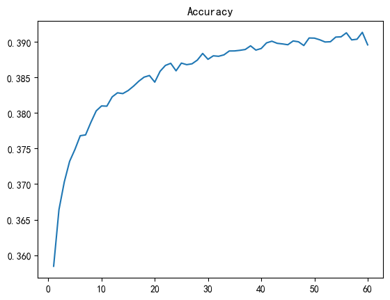
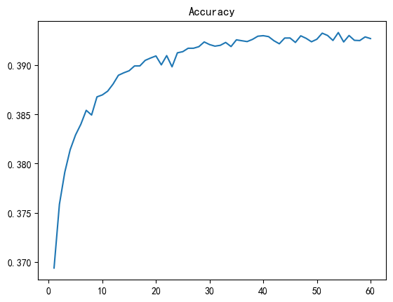
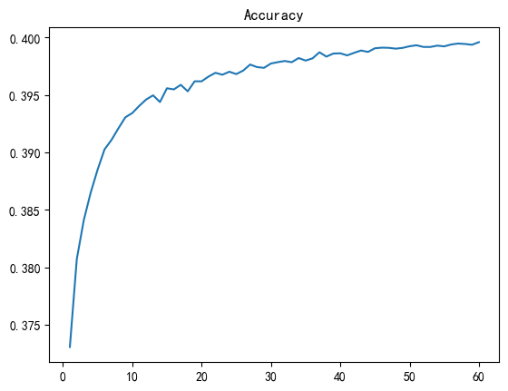
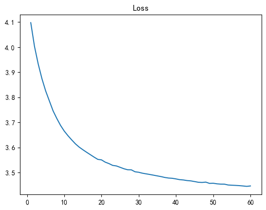
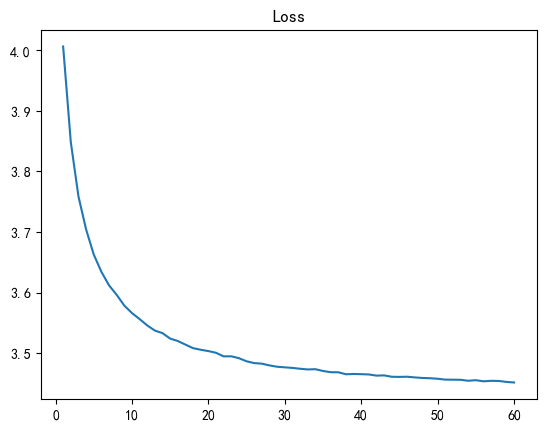
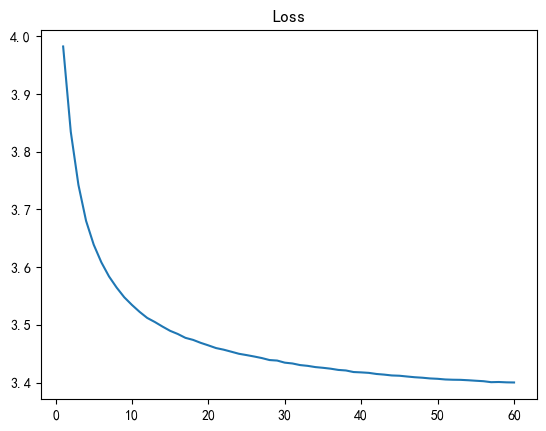

# 第二次大作业 - FNN, RNN, LSTM 词向量对比分析

## 实验任务

在北京大学标注的《人民日报》1998年1月份的分词语料库上，分别训练 FNN, RNN, LSTM 三种模型，提取各自学习到的词向量查找表，对比分析这三种模型生成的词向量的差异性。

## 数据预处理

这部分的代码见 `dataset.py`

### 确定词表范围

首先，我对预料库中出现的词汇进行了统计，并按词频从高到低排序，得到了词频统计文件 `word_counts.txt`。可以看到，排名前1000的词汇出现次数均超过了一百。为了减少网络参数，充分利用硬件性能，我决定将词表范围限制在最常见的前1024个词。（准确说是前1023个词；多余的一个词预留为\<UNK\>，用于代替不常见的词汇）这也便是超参数中的 `vocab_size` 一项。

词频统计主要通过`Counter`库实现。

### 制作数据集

注意到FNN模型和RNN/LSTM模型的输入输出不同，应使用不同的数据集。因此我制作了 `data_n_gram.pkl` 和 `data_rnn.pkl` 分别供FNN和RNN/LSTM使用。

`data_n_gram.pkl` 的输入值为一个长为 `n-1` 的序列，标签值为这个序列的下一个值。为了简化模型，我将RNN/LSTM的输入也固定为长为 `n-1` 的序列。因此 `data_rnn.pkl` 的输入值也是一个长为 `n-1` 的序列。它的标签值是一个与输入值相错一位的序列，长度同样是 `n-1` 。

我按4:1的比例将原始[X,y]对在随机打乱后切分为了训练集与测试集。其中，Dataloader的使用参考了[【python】pytorch中如何使用DataLoader对数据集进行批处理](https://blog.csdn.net/zkq_1986/article/details/85249220)。

这部分的核心代码如下：

```python
import torch
import torch.utils.data as Data

class Dataset():
    ...
    def gen(...):
        ...
        dataset = Data.TensorDataset(torch.tensor(x), torch.tensor(y))
        train_size = int(0.8 * len(dataset))
        test_size = len(dataset) - train_size
        self.train_dataset, self.test_dataset = Data.random_split(dataset, [train_size, test_size])
        self.train_dataloader = Data.DataLoader(self.train_dataset, batch_size=batch_size, shuffle=True)
        self.test_dataloader = Data.DataLoader(self.test_dataset, batch_size=batch_size, shuffle=True)
        print("train batch count:", len(self.train_dataloader))
        print("test batch count:", len(self.test_dataloader))
```

其中，

```python
n = 9               # 模型的预测取决于之前的n-1个词汇
batch_size = 512    # 批处理大小
```

FNN数据集大小为（RNN/LSTM数据集大小相近）：

```plain
train batch count: 1555
test batch count: 389
```

## 模型实现

### FNN

```python
class FNN(nn.Module):
    def __init__(self, vocab_size, input_size, embedding_dim, hidden_size):
        super().__init__()
        self.embedding = nn.Embedding(vocab_size, embedding_dim)
        self.norm = nn.LayerNorm(embedding_dim, elementwise_affine=False)
        self.flatten = nn.Flatten()
        self.linear_relu_stack = nn.Sequential(
            nn.Linear(input_size, hidden_size),
            nn.ReLU(),
            nn.Linear(hidden_size, embedding_dim),
            nn.ReLU()
        )
        
    def forward(self, x):
        x = self.embedding(x)
        x = self.norm(x)
        x = self.flatten(x)
        x = self.linear_relu_stack(x)
        x = torch.matmul(x, self.embedding.weight.T)
        return x
```

输入数据会首先经过一层嵌入层，将输入的 `n-1` 个词汇序号转换为 `n-1` 个 `embedding_dim` 维的词向量。这些向量在层归一化后，被压平成一个长为 `input_size = embedding_dim*(n-1)` 的向量。这个向量被送往一个隐藏层大小为 `hidden_size` 的两层网络，输出一个和词向量同维的向量，作为分类的依据。

这个输出的词向量会和嵌入层中的词汇表进行点乘，以计算与各词汇余弦距离，并依此分类。由于pytorch的交叉熵损失函数中自带了Softmax层，因此模型的最后并没有引入Softmax。但实际使用时，如果期望模型的输出为各类别下的概率，我们还是需要额外做一次Softmax。

### RNN

```python
class RNN(nn.Module):
    def __init__(self, vocab_size, input_size, embedding_dim, hidden_size):
        super().__init__()
        self.embedding = nn.Embedding(vocab_size, embedding_dim)
        self.norm = nn.LayerNorm(embedding_dim, elementwise_affine=False)
        self.rnn = nn.RNN(input_size, hidden_size, batch_first=True)
        self.linear_relu = nn.Sequential(
            nn.Linear(hidden_size, embedding_dim),
            nn.ReLU()
        )
        
    def forward(self, x):
        x = self.embedding(x)
        x = self.norm(x)
        x, _ = self.rnn(x)
        x = self.linear_relu(x)
        x = torch.matmul(x, self.embedding.weight.T)
        return x
```

RNN的设计与FNN相似。不同的是，`nn.RNN` 层输出 `n-1` 个不同时刻的隐层向量。在经过一层线性网络后，和FNN一样被送往与嵌入层的词汇表做点积，以判断这 `n-1` 个输出各自与不同词汇的相似程度。

### LSTM

```python
class LSTM(nn.Module):
    def __init__(self, vocab_size, input_size, embedding_dim, hidden_size):
        super().__init__()
        self.embedding = nn.Embedding(vocab_size, embedding_dim)
        self.norm = nn.LayerNorm(embedding_dim, elementwise_affine=False)
        self.lstm = nn.LSTM(input_size, hidden_size, batch_first=True)
        self.linear_relu = nn.Sequential(
            nn.Linear(hidden_size, embedding_dim),
            nn.ReLU()
        )
        
    def forward(self, x):
        x = self.embedding(x)
        x = self.norm(x)
        x, _ = self.lstm(x)
        x = self.linear_relu(x)
        x = torch.matmul(x, self.embedding.weight.T)
        return x
```

得益于pytorch良好的封装与接口定义，LSTM的实现与RNN几乎一致（只需把RNN改成LSTM），此处不再赘述。

## 实验结果

### 训练与测试

为尽量控制变量一致，三个模型均以 `1e-3` 的 `learning_rate` 和 `512` 的 `batch_size`，使用Adam优化器与交叉熵损失，在数据集上训练了共60个epoch。

模型的其他参数也保持一致，如下所示：

```plain
vocab_size = 1024
embedding_dim = 16
n = 9
hidden_size = 64
```

每过100个batch，将输出一次训练误差。

每过1个epoch，将输出一次测试误差与准确率，并作为绘图的一个采样点。

每过5个epoch，将自动保存一次模型参数到 `checkpoint/` 文件夹下，按 `<model>-<epoch>.pth` 命名。

训练结果如下所示（横坐标均为epoch；Accuracy和Loss均按FNN、RNN、LSTM的顺序排序）：

<center>


图1 - FNN Accuracy


图2 - RNN Accuracy


图3 - LSTM Accuracy


图4 - FNN Loss


图5 - RNN Loss


图6 - LSTM Loss

</center>

取最终结果，制表得：

| 模型 | Accuracy | Avg Loss |
| --- | --- | --- |
| FNN | 39.0% | 3.446573 |
| RNN | 39.3% | 3.451318 |
| LSTM | 40.0% | 3.400063 |

可以看到，无论是Accuracy还是Test Loss，LSTM均优于RNN和FNN，这与理论结果一致。

RNN的Accuracy略优于FNN，FNN的Loss略优于RNN，两者可谓不分伯仲。

由此我们可以发现，是LSTM的提出让RNN彻底与FNN拉开差距，成为序列预测的主流模型。

此外，我们可以看到，LSTM的收敛速度快于RNN快于FNN——这从曲线的陡峭程度可见一斑。

### 有效性验证

怎么说明我训练的模型确实是有效的呢？显然，如果直接输入一个序列并根据输出的结果来评判，带有较浓的主观色彩，很难令人信服。

考虑到我们实验的任务是获得词向量。我们可以选择一个词，利用嵌入层中的词汇表计算与它最接近的十个词汇。我选择了“５/m”这个词汇，这是因为，这是一个数字，相比其余词汇在词表中具有更多的相似词。若它能匹配与之类似的数词（以“/m”结尾），则证明我训练的模型是有效的。

三个模型各自词汇表中与“５/m”这个词汇最接近的十个词汇（及其相似度）如下所示：

```plain
FNN
５/m
５/m 1.0
７/m 0.9449776
５０/m 0.9285177
３/m 0.90999705
十/m 0.9077617
１０/m 0.9035196
２/m 0.87599367
１００/m 0.87301916
半/m 0.8710296
３０/m 0.8700875

RNN
５/m
５/m 1.0000001
７/m 0.9834264
３/m 0.9540849
４/m 0.94326097
６/m 0.93655044
８/m 0.92932755
１/m 0.8846019
１０/m 0.8825027
５０/m 0.867739
１００/m 0.7978319

LSTM
５/m
５/m 1.0000001
４/m 0.9949931
３/m 0.98976105
８/m 0.986077
１０/m 0.9640682
６/m 0.95115286
２０/m 0.9255739
７/m 0.9108216
２/m 0.8982253
３０/m 0.8968242
```

可以看到，三个模型都给出了数字或数量描述性词的结果，证明模型是有效的。

值得注意的是，对于LSTM及RNN，模型甚至一定程度上学到了该数字对应数值的语义信息——与之相似度越高的词具有越接近的数值！

### 相似单词测试

随机选择20个单词，对于这三个模型分别计算与其词向量最相似的前10个单词。测试文件见 `analysis.ipynb`，结果过长，我放在了附录。这里选取几组进行分析：

#### 提高/v

```plain
提高/v
top 10 similar words in FNN:
| 提高/v 1.0
| 增强/v 0.9145938
| 加大/v 0.8863197
| 改善/v 0.8532969
| 依法/d 0.83858895     # unrelated
| 扩大/v 0.8376286
| 增加/v 0.82624644
| 研究/v 0.82347596     # unrelated
| 保护/v 0.80229354
| 影响/v 0.79977155     # unrelated
top 10 similar words in RNN:
| 提高/v 1.0
| 改善/v 0.8992528
| 增强/v 0.87708867
| 减少/v 0.8366704      # opposite
| 促进/v 0.825556
| 扩大/v 0.8065421
| 加强/v 0.8064306
| 帮助/v 0.80545354     # unrelated
| 发展/v 0.8015406
| 保护/v 0.8005275
top 10 similar words in LSTM:
| 提高/v 0.99999994
| 增强/v 0.8572005
| 深化/v 0.85225123
| 完善/v 0.84842306
| 维护/v 0.786094
| 保持/v 0.7835352
| 加强/v 0.78141564
| 扩大/v 0.77258646
| 加快/v 0.76766187
| 改善/v 0.7664237
```

可以看到，三个模型清一色匹配了动词，匹配结果中出现了大量“提高”相关的同义词，这是符合预期的。此外，FNN出现了三个相关程度不是很高的词，RNN减少到了一个，LSTM一个都没有——这再次说明了LSTM优于RNN优于FNN。

#### [中央/n

```plain
[中央/n
top 10 similar words in FNN:
| [中央/n 1.0
| [国家/n 0.96248627
| [中国/ns 0.9283081    # 国名
| [全国/n 0.92518127
| 英国/ns 0.8885466     # 国名
| [上海/ns 0.86471623
| 俄罗斯/ns 0.85656345  # 国名
| 自治区/n 0.8472166
| 韩国/ns 0.8465545     # 国名
| 泰国/ns 0.84284866    # 国名
top 10 similar words in RNN:
| [中央/n 1.0
| [国家/n 0.9614538
| [中国/ns 0.9366956    # 国名
| [北京/ns 0.8813087
| [上海/ns 0.84907675
| 自治区/n 0.8306463
| 泰国/ns 0.809421      # 国名
| 韩国/ns 0.7967012     # 国名
| [中共中央/nt 0.79579103
| [美国/ns 0.79564255   # 国名
top 10 similar words in LSTM:
| [中央/n 0.9999999
| [国家/n 0.9378362
| [全国/n 0.8085585
| 国务院/nt 0.76516944
| [北京/ns 0.76076376
| [上海/ns 0.7285284
| [中国/ns 0.7259561    # 国名
| [美国/ns 0.7090461    # 国名
| 以色列/ns 0.6909199   # 国名
| [中共中央/nt 0.6797718
```

这个词元本身带有左括号，可以看到，它匹配到的词元也大都带有左括号——这说明我们的模型可以识别词元在语句内的结构信息。此外，通过对结果的观察，我们不难发现，LSTM模型匹配了更多的相关词元，而FNN以及RNN似乎更多地将“中央”的概念与“国家”的概念等同了起来。

## 文件结构

```plain
.
├── analysis.ipynb          # 词向量分析
├── checkpoint              # 训练结果*
│   ├── FNN-5.pth
│   ├── ...
│   ├── FNN-60.pth
│   ├── LSTM-5.pth
│   ├── ...
│   ├── LSTM-60.pth
│   ├── RNN-5.pth
│   ├── ...
│   └── RNN-60.pth
├── ChineseCorpus199801.txt # 语料库
├── data_n_gram.pkl         # 经加工的数据集，供FNN使用*
├── data_rnn.pkl            # 经加工的数据集，供RNN、LSTM使用*
├── dataset.py              # 数据集制作
├── FNN-Accuracy.png
├── FNN-Loss.png
├── FNNv2.ipynb             # FNN模型的训练与测试
├── LSTM-Accuracy.png
├── LSTM-Loss.png
├── LSTMv2.ipynb            # LSTM模型的训练与测试
├── NNv2.py                 # FNN、RNN、LSTM模型的实现
├── README.md
├── RNN-Accuracy.png
├── RNN-Loss.png
├── RNNv2.ipynb             # RNN模型的训练与测试
└── word_counts.txt         # 词频统计*

注：带有*号的文件为程序运行的结果
```

## 参考网页

- [Quickstart — PyTorch Tutorials 2.0.0+cu117 documentation](https://pytorch.org/tutorials/beginner/basics/quickstart_tutorial.html)
- [【python】pytorch中如何使用DataLoader对数据集进行批处理](https://blog.csdn.net/zkq_1986/article/details/85249220)

## 附录

### 相似单词测试结果

```plain
choosing word list: ['[中央/n', '腐败/an', '开放/v', '没有/v', '标准/n', '？/w', '基础/n', '思想/n', '[北京/ns', '虽然/c', '而/c', '泽民/nr', '提高/v', '特别/d', '报道/v', '形式/n', '创造/v', '外国/n', '股份制/n', '其/r']
load model from checkpoint/FNN-60.pth
lookup table shape: (1024, 16)
load model from checkpoint/RNN-60.pth
lookup table shape: (1024, 16)
load model from checkpoint/LSTM-60.pth
lookup table shape: (1024, 16)
--------------------
[中央/n
top 10 similar words in FNN:
| [中央/n 1.0
| [国家/n 0.96248627
| [中国/ns 0.9283081
| [全国/n 0.92518127
| 英国/ns 0.8885466
| [上海/ns 0.86471623
| 俄罗斯/ns 0.85656345
| 自治区/n 0.8472166
| 韩国/ns 0.8465545
| 泰国/ns 0.84284866
top 10 similar words in RNN:
| [中央/n 1.0
| [国家/n 0.9614538
| [中国/ns 0.9366956
| [北京/ns 0.8813087
| [上海/ns 0.84907675
| 自治区/n 0.8306463
| 泰国/ns 0.809421
| 韩国/ns 0.7967012
| [中共中央/nt 0.79579103
| [美国/ns 0.79564255
top 10 similar words in LSTM:
| [中央/n 0.9999999
| [国家/n 0.9378362
| [全国/n 0.8085585
| 国务院/nt 0.76516944
| [北京/ns 0.76076376
| [上海/ns 0.7285284
| [中国/ns 0.7259561
| [美国/ns 0.7090461
| 以色列/ns 0.6909199
| [中共中央/nt 0.6797718
--------------------
腐败/an
top 10 similar words in FNN:
| 腐败/an 1.0
| 艺术/n 0.8149397
| 传统/n 0.78067625
| 革命/vn 0.77356935
| 作品/n 0.7724955
| 妇女/n 0.73896384
| 最高/a 0.73750734
| 比赛/vn 0.73311615
| 基础/n 0.7259082
| 扶贫/vn 0.7223426
top 10 similar words in RNN:
| 腐败/an 1.0
| 关系/n 0.6453169
| 工作/vn 0.64528584
| 斗争/vn 0.6396444
| 任务/n 0.6254831
| 重点/n 0.6223689
| 有关/vn 0.61591494
| 民族/n 0.5905675
| 人士/n 0.5897207
| 主席/n 0.58840823
top 10 similar words in LSTM:
| 腐败/an 0.99999994
| 质量/n 0.7564819
| 健康/a 0.72963995
| 竞争/vn 0.7202883
| 增长/vn 0.7059504
| 严重/a 0.6999753
| 范围/n 0.6692791
| 处理/v 0.6610712
| 计划/n 0.6578175
| 约/d 0.6437206
--------------------
开放/v
top 10 similar words in FNN:
| 开放/v 1.0
| 反映/v 0.77299786
| 稳定/v 0.769197
| 生产/v 0.7606014
| 落实/v 0.74795103
| 执行/v 0.74372
| 深入/v 0.7280447
| 学习/v 0.7094101
| 扩大/v 0.70563585
| 表现/v 0.6817399
top 10 similar words in RNN:
| 开放/v 1.0
| 内/f 0.7115003
| 深入/v 0.68450344
| 进入/v 0.66866773
| 参与/v 0.64155555
| 改革/vn 0.6336144
| 规定/v 0.62401986
| 先/d 0.6209651
| 生产/v 0.62039423
| 会议/n 0.6188561
top 10 similar words in LSTM:
| 开放/v 1.0000001
| 重视/v 0.69693065
| 发展/v 0.6691189
| 为主/v 0.6145188
| 下降/v 0.6086414
| 上年/t 0.6021279
| 如何/r 0.58995414
| 发挥/v 0.55444413
| 相/d 0.55396855
| 增加/v 0.5362526
--------------------
没有/v
top 10 similar words in FNN:
| 没有/v 1.0
| 可以/v 0.7930299
| 应该/v 0.77053297
| 不/d 0.75787216
| 要/v 0.75093746
| 搞/v 0.750242
| 没有/d 0.7465213
| 得/v 0.74048066
| 正是/v 0.73821187
| 然而/c 0.7378791
top 10 similar words in RNN:
| 没有/v 1.0
| 未/d 0.8619925
| 请/v 0.84523463
| 没有/d 0.78341556
| 拿/v 0.78101665
| 没/d 0.77173835
| 得/v 0.7690289
| 知道/v 0.7499397
| 可以/v 0.74299175
| 带/v 0.7353971
top 10 similar words in LSTM:
| 没有/v 0.99999994
| 只要/c 0.7949623
| 应/v 0.7912084
| 要/v 0.77942014
| 请/v 0.7605568
| 想/v 0.7505034
| 应该/v 0.74740803
| 希望/v 0.7468562
| 需要/v 0.72376573
| 准备/v 0.7212781
--------------------
标准/n
top 10 similar words in FNN:
| 标准/n 1.0000001
| 计划/n 0.92041415
| 经验/n 0.87603354
| 成果/n 0.8648273
| 环境/n 0.8498667
| 责任/n 0.84004325
| 队伍/n 0.8357369
| 服务/vn 0.8310387
| 项目/n 0.82786626
| 管理/vn 0.8260444
top 10 similar words in RNN:
| 标准/n 0.99999994
| 方法/n 0.90901256
| 方式/n 0.88558924
| 机制/n 0.8832685
| 开发/vn 0.86849296
| 观念/n 0.8428873
| 案件/n 0.8390021
| 能力/n 0.82973516
| 特点/n 0.8253744
| 知识/n 0.819509
top 10 similar words in LSTM:
| 标准/n 0.9999999
| 范围/n 0.85739094
| 要求/n 0.8565451
| 协议/n 0.8504797
| 行为/n 0.81075287
| 案件/n 0.8107074
| 斗争/vn 0.8043319
| 意见/n 0.7988578
| 原则/n 0.79299074
| 现象/n 0.78955454
--------------------
？/w
top 10 similar words in FNN:
| ？/w 0.99999994
| ！/w 0.86982524
| 。/w 0.7807208
| 了/y 0.72639835
| ……/w 0.6910074
| 去/v 0.6579074
| 来/v 0.64404845
| 什么/r 0.6072279
| 调查/vn 0.6005726
| ：/w 0.5783217
top 10 similar words in RNN:
| ？/w 1.0
| 。/w 0.74103606
| ！/w 0.73616725
| ……/w 0.72956157
| 或/c 0.6526862
| 又/c 0.6507491
| 甚至/d 0.63602626
| 而/c 0.6287164
| 令/v 0.625175
| 之后/f 0.5894703
top 10 similar words in LSTM:
| ？/w 1.0
| ！/w 0.85166526
| ……/w 0.8155937
| 呢/y 0.6808292
| 了/y 0.655033
| 着/u 0.6393109
| ———/w 0.6299405
| 话/n 0.62783456
| 得/u 0.6202955
| 努力/an 0.61355156
--------------------
基础/n
top 10 similar words in FNN:
| 基础/n 0.9999999
| 道路/n 0.84070677
| 艺术/n 0.8203124
| 实践/vn 0.81934404
| 实际/n 0.79345006
| 传统/n 0.76536965
| 实践/v 0.7622392
| 过程/n 0.7379149
| 主要/b 0.73072577
| 腐败/an 0.7259082
top 10 similar words in RNN:
| 基础/n 1.0
| 战略/n 0.8276708
| 研究/vn 0.78150815
| 行动/vn 0.762874
| 宣传/vn 0.75947875
| 统一/vn 0.74422914
| 信息/n 0.71351105
| 外交/n 0.7067851
| 领导/vn 0.70657754
| 服务/vn 0.69611055
top 10 similar words in LSTM:
| 基础/n 1.0
| 重点/n 0.80076987
| 战略/n 0.76705766
| 思想/n 0.704694
| 支持/vn 0.697239
| 原则/n 0.6853967
| 领导/vn 0.682359
| 首/m 0.6645113
| 项目/n 0.6622716
| 宣传/vn 0.65092146
--------------------
思想/n
top 10 similar words in FNN:
| 思想/n 1.0000001
| 理论/n 0.8504963
| 要求/n 0.8186111
| 支持/vn 0.81447625
| 特点/n 0.81278396
| 条件/n 0.80105424
| 发展/vn 0.7952572
| 力度/n 0.78108513
| 困难/an 0.77969563
| 原则/n 0.77911335
top 10 similar words in RNN:
| 思想/n 1.0
| 经营/vn 0.8642666
| 实际/n 0.8406977
| 政策/n 0.8301469
| 人才/n 0.82635957
| 资本/n 0.8122531
| 道路/n 0.79513574
| 优势/n 0.7880134
| 产品/n 0.7854667
| 理论/n 0.78019214
top 10 similar words in LSTM:
| 思想/n 0.9999999
| 素质/n 0.8216631
| 利益/n 0.74890417
| 方法/n 0.72425574
| 设备/n 0.7190145
| 优势/n 0.7162904
| 形象/n 0.7141867
| 政策/n 0.7103598
| 能力/n 0.705758
| 基础/n 0.704694
--------------------
[北京/ns
top 10 similar words in FNN:
| [北京/ns 0.99999994
| [上海/ns 0.90627235
| 经/p 0.8721485
| [中国/ns 0.8618762
| [国家/n 0.847891
| [中央/n 0.8336996
| [中共中央/nt 0.82173586
| [美国/ns 0.81861293
| 每/r 0.8030766
| 公安/n 0.7999518
top 10 similar words in RNN:
| [北京/ns 0.99999994
| [中国/ns 0.89526176
| [中央/n 0.8813087
| [上海/ns 0.8782958
| [美国/ns 0.836691
| [国家/n 0.8258642
| [人民/n 0.7722325
| 新华社/nt 0.76851416
| 泰国/ns 0.76053935
| 北京/ns 0.7485362
top 10 similar words in LSTM:
| [北京/ns 0.99999994
| [上海/ns 0.91430867
| [国家/n 0.82537556
| [美国/ns 0.82231116
| 俄罗斯/ns 0.8169633
| [中国/ns 0.77164334
| 日本/ns 0.7652295
| [中央/n 0.76076376
| 中央/n 0.754359
| 德国/ns 0.74880934
--------------------
虽然/c
top 10 similar words in FNN:
| 虽然/c 1.0
| 然而/c 0.7964949
| 如今/t 0.78924537
| 只要/c 0.78290594
| 只有/c 0.77415276
| 因此/c 0.76898897
| 而/c 0.76706374
| 因为/c 0.75786865
| 对于/p 0.74849164
| 如果/c 0.74101484
top 10 similar words in RNN:
| 虽然/c 1.0
| 只有/c 0.8956718
| 只要/c 0.8346731
| 然而/c 0.7606751
| 如果/c 0.748757
| 已经/d 0.7484799
| 不仅/c 0.72385377
| 正/d 0.7122253
| 既/c 0.708471
| 便/d 0.7083438
top 10 similar words in LSTM:
| 虽然/c 1.0
| 对于/p 0.86147034
| 应该/v 0.8369366
| 不仅/c 0.83609366
| 则/c 0.81276095
| 要/v 0.7444713
| 请/v 0.7425498
| 主要/d 0.73992383
| 既/c 0.7343108
| 正在/d 0.73040223
--------------------
而/c
top 10 similar words in FNN:
| 而/c 1.0
| 虽然/c 0.76706374
| 如今/t 0.75119686
| 因此/c 0.71012014
| 了解/v 0.6959746
| 同时/c 0.6931132
| 资源/n 0.6731827
| 不/d 0.6670315
| 二/m 0.6612268
| 只要/c 0.65784365
top 10 similar words in RNN:
| 而/c 1.0
| 又/c 0.78451073
| 或/c 0.78126925
| 但/c 0.7586304
| 甚至/d 0.71790737
| 但是/c 0.64558685
| 而是/c 0.62896097
| ？/w 0.6287164
| 并/c 0.61901915
| 而且/c 0.61436343
top 10 similar words in LSTM:
| 而/c 1.0
| 还有/v 0.7416206
| 其中/r 0.7363163
| 成为/v 0.6468034
| 而且/c 0.6159637
| 又/c 0.60936254
| 占/v 0.5848023
| 素质/n 0.56424916
| 』/w 0.55786896
| 并/d 0.5553396
--------------------
泽民/nr
top 10 similar words in FNN:
| 泽民/nr 0.9999999
| 银行/n]nt 0.85381603
| 委员会/n 0.83333844
| 委员会/n]nt 0.79979974
| 工业/n 0.74493474
| 批准/v 0.74013054
| 主席/n 0.70163816
| 公司/n]nt 0.6894603
| 协会/n]nt 0.6805619
| 基层/n 0.67602956
top 10 similar words in RNN:
| 泽民/nr 1.0
| 恩来/nr 0.72386676
| 第二/m 0.7199823
| 小平/nr 0.7111087
| 首/m 0.6844678
| 系列/q 0.67170703
| 比赛/vn 0.6690747
| 张/q 0.6456069
| 友好/a 0.6358705
| 第一/m 0.63166755
top 10 similar words in LSTM:
| 泽民/nr 1.0
| 其琛/nr 0.8190287
| 先生/n 0.80968034
| 介绍/v 0.6807202
| 送/v 0.608551
| 分/q 0.6079673
| 发/v 0.6047025
| 约/d 0.5645179
| 上/f 0.5524548
| 当/p 0.51623785
--------------------
提高/v
top 10 similar words in FNN:
| 提高/v 1.0
| 增强/v 0.9145938
| 加大/v 0.8863197
| 改善/v 0.8532969
| 依法/d 0.83858895
| 扩大/v 0.8376286
| 增加/v 0.82624644
| 研究/v 0.82347596
| 保护/v 0.80229354
| 影响/v 0.79977155
top 10 similar words in RNN:
| 提高/v 1.0
| 改善/v 0.8992528
| 增强/v 0.87708867
| 减少/v 0.8366704
| 促进/v 0.825556
| 扩大/v 0.8065421
| 加强/v 0.8064306
| 帮助/v 0.80545354
| 发展/v 0.8015406
| 保护/v 0.8005275
top 10 similar words in LSTM:
| 提高/v 0.99999994
| 增强/v 0.8572005
| 深化/v 0.85225123
| 完善/v 0.84842306
| 维护/v 0.786094
| 保持/v 0.7835352
| 加强/v 0.78141564
| 扩大/v 0.77258646
| 加快/v 0.76766187
| 改善/v 0.7664237
--------------------
特别/d
top 10 similar words in FNN:
| 特别/d 0.9999999
| 尤其/d 0.9339835
| 既/c 0.80454105
| 则/d 0.78852797
| 只/d 0.7480717
| 这/r 0.73080957
| 不仅/c 0.7250104
| 自/p 0.6975949
| 只要/c 0.68544596
| 如果/c 0.6845714
top 10 similar words in RNN:
| 特别/d 0.99999994
| 尤其/d 0.86832106
| 才/c 0.7406587
| 一/d 0.68910265
| 先/d 0.6762216
| 只要/c 0.6376308
| 多/ad 0.6269831
| 努力/ad 0.6185676
| 才/d 0.6165093
| 以/c 0.60376525
top 10 similar words in LSTM:
| 特别/d 1.0
| 尤其/d 0.88004434
| 主要/d 0.76142114
| 又/c 0.7577761
| 充分/ad 0.73589706
| 只/d 0.7289952
| 才/c 0.71502084
| 更/d 0.7140667
| 越来越/d 0.7124686
| 认真/ad 0.6934563
--------------------
报道/v
top 10 similar words in FNN:
| 报道/v 1.0000002
| 送/v 0.75121135
| 拿/v 0.72822773
| 日前/t 0.72208595
| 走/v 0.7030455
| 政协/j]nt 0.6586025
| 大学/n]nt 0.6503458
| 图/n 0.64917123
| 访问/v 0.64059466
| 近日/t 0.6366478
top 10 similar words in RNN:
| 报道/v 0.99999994
| 摄/Vg 0.6579706
| 出席/v 0.62746716
| 指出/v 0.59282476
| 日前/t 0.5840635
| 新华社/nt 0.58303744
| 本报/r 0.57696307
| 了解/v 0.5430923
| ）/w 0.53757274
| 起/v 0.5366199
top 10 similar words in LSTM:
| 报道/v 1.0
| 就业/v 0.773442
| 介绍/v 0.70858973
| 今天/t 0.64670295
| 达/v 0.5946859
| 书记/n 0.55012894
| 黄/nr 0.54850996
| 委员/n 0.53993547
| 宣布/v 0.53974533
| 加大/v 0.5375536
--------------------
形式/n
top 10 similar words in FNN:
| 形式/n 1.0
| 成果/n 0.9327139
| 经验/n 0.8228431
| 生活/vn 0.82187235
| 计划/n 0.81859136
| 中心/n 0.80758977
| 问题/n 0.8066153
| 标准/n 0.79518294
| 同时/n 0.7932121
| 结果/n 0.79085046
top 10 similar words in RNN:
| 形式/n 0.99999994
| 内容/n 0.87845314
| 项目/n 0.8782561
| 因素/n 0.8636623
| 原因/n 0.81948525
| 目的/n 0.7766398
| 行业/n 0.77262306
| 特点/n 0.7618525
| 手段/n 0.7564867
| 人才/n 0.7517062
top 10 similar words in LSTM:
| 形式/n 1.0
| 价格/n 0.87643194
| 方式/n 0.86526215
| 因素/n 0.8528547
| 方法/n 0.82959396
| 行为/n 0.825633
| 办法/n 0.79009414
| 观念/n 0.7877851
| 力量/n 0.78085744
| 责任/n 0.7695286
--------------------
创造/v
top 10 similar words in FNN:
| 创造/v 1.0000001
| 发挥/v 0.8587487
| 产生/v 0.8501405
| 增强/v 0.84947795
| 作出/v 0.83573544
| 加大/v 0.83205235
| 取得/v 0.82550186
| 受到/v 0.8076588
| 保持/v 0.79833496
| 得到/v 0.7863779
top 10 similar words in RNN:
| 创造/v 1.0
| 作出/v 0.84030616
| 实行/v 0.8253802
| 进行/v 0.7861018
| 形成/v 0.7821139
| 保持/v 0.7794252
| 影响/v 0.7787229
| 保证/v 0.7713562
| 提供/v 0.76962304
| 调整/v 0.7684475
top 10 similar words in LSTM:
| 创造/v 1.0
| 实现/v 0.8435358
| 提供/v 0.801734
| 造成/v 0.79708135
| 办/v 0.7953206
| 产生/v 0.7810722
| 促进/v 0.78045386
| 保证/v 0.77368295
| 服务/v 0.77059567
| 做/v 0.76806426
--------------------
外国/n
top 10 similar words in FNN:
| 外国/n 0.99999994
| 优秀/a 0.829116
| 地/n 0.8135146
| 天津/ns 0.8027398
| 大型/b 0.7808763
| 专业/n 0.73855364
| 商业/n 0.73737156
| 欧洲/ns 0.7363947
| 各国/r 0.729223
| 亚洲/ns 0.7281206
top 10 similar words in RNN:
| 外国/n 1.0000001
| 基层/n 0.75902957
| 国际/n 0.7193378
| 整个/b 0.71239626
| 城市/n 0.6999592
| 各/r 0.6969039
| 全/a 0.68832207
| 青年/n 0.6867413
| 学生/n 0.68549883
| 一些/m 0.68168676
top 10 similar words in LSTM:
| 外国/n 1.0
| 青年/n 0.8598199
| 旅客/n 0.8353198
| 医院/n 0.8233537
| 读者/n 0.8132497
| 市民/n 0.8106861
| 学生/n 0.8021686
| 官兵/n 0.8005749
| 过去/t 0.7805394
| 股市/n 0.7624638
--------------------
股份制/n
top 10 similar words in FNN:
| 股份制/n 1.0
| 人类/n 0.82139254
| 住房/n 0.81627685
| 时代/n 0.7975188
| 邓小平理论/n 0.7810259
| 理论/n 0.7790441
| 国民经济/n 0.77748585
| 京剧/n 0.7736904
| 党/n 0.767895
| 和平/n 0.7498599
top 10 similar words in RNN:
| 股份制/n 1.0000001
| 外资/n 0.8063979
| 产业/n 0.7458379
| 国有/vn 0.7434821
| 教育/vn 0.73809546
| 改革/v 0.73561513
| 传统/n 0.73458767
| 资本/n 0.72753716
| 资产/n 0.7013358
| 科学/n 0.6990005
top 10 similar words in LSTM:
| 股份制/n 1.0
| 社会/n 0.7481111
| 法律/n 0.7120333
| 一定/b 0.6902244
| 技术/n 0.6750043
| 竞争/vn 0.67345774
| 实际/a 0.66866446
| 风险/n 0.66733587
| 科学/n 0.658656
| 地位/n 0.6527891
--------------------
其/r
top 10 similar words in FNN:
| 其/r 1.0000001
| 有的/r 0.83303344
| 整个/b 0.82724667
| 那/r 0.76770175
| 由于/c 0.74539804
| 各种/r 0.74078727
| 所有/b 0.73475814
| 居民/n 0.7346992
| 交通/n 0.7093861
| 这个/r 0.7071306
top 10 similar words in RNN:
| 其/r 1.0
| 一些/m 0.8591404
| 不少/m 0.8189615
| 这些/r 0.78687835
| 所有/b 0.7804066
| 这个/r 0.74406135
| 它/r 0.7430729
| 任何/r 0.731089
| 这种/r 0.72995186
| 我们/r 0.71838653
top 10 similar words in LSTM:
| 其/r 1.0
| 所有/b 0.7155783
| 我们/r 0.70035565
| 今后/t 0.6979576
| 当地/s 0.69649637
| 我/r 0.68891644
| 日本/ns 0.67834556
| 实际/a 0.6690678
| 他们/r 0.66576964
| 你/r 0.66007847

```