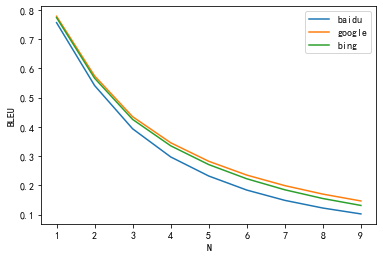

# 第三次大作业 - BLEU 计算

## 实验任务

编写程序，实现BLEU值的计算。可以从网络上选择高质量的平行句对，利用所写的BLEU值计算程序和平行句对，计算三个不同翻译引擎（如百度、搜狗、微软“必应”等）的译文BLEU值。

## 准备数据

实验数据来自于 `data` 目录下的 `newstest2018-zhen-ref-ts.en.sgm` 和 `newstest2018-zhen-src-ts.zh.sgm` 两个文件。后者为待翻译的中文源文本，前者为参考的英文译文。

### 数据清洗

原始文本数据中包含了大量标签信息，这些信息不应该作为翻译的一部分，因此需要将其清洗掉。这里使用了 `BeautifulSoup` 库来进行清洗。

```python
ref_txt = BeautifulSoup(ref).get_text()
```

经 `BeautifulSoup` 解析后的文本带有大量空行，下述代码用于将其去除。

```python
ref_lines = ref_txt.split("\n")
ref_txt = "\n".join([line for line in ref_lines if line != ""])
```

对 `src` 做同样的处理，不再赘述。清洗后的数据保存在 `output` 目录下，文件名分别为 `newstest2018-zhen-ref-ts.en.txt` 和 `newstest2018-zhen-src-ts.zh.txt`。

### 随机采样

原始文本共3981行，中文文本和英文文本行数相同，对应行号的文本为平行句对。

由于各大翻译软件大都一次性只支持翻译5000个词语，因此我只随机采样了100行数据作为统计样本。

```python
ref_lines = ref_txt.split("\n")
src_lines = src_txt.split("\n")
length = len(ref_lines)
assert length == len(src_lines)
random.seed(2023)
idx = random.sample(range(length), 100)
src_selected = [src_lines[i] for i in idx]
ref_selected = [ref_lines[i] for i in idx]
src_selected = "\n".join(src_selected)
ref_selected = "\n".join(ref_selected)
```

随机采样后的数据也同样保存在 `output` 目录下，文件名分别为 `ref_randomly_selected.txt` 和 `src_randomly_selected.txt`。

### 获取翻译

我分别在百度、谷歌、必应三个翻译引擎上对 `src_randomly_selected.txt` 进行了翻译，翻译结果保存在根目录下，文件名分别为 `baidu.txt`、`google.txt` 和 `bing.txt`。

翻译结果同样为100行，相同行号的文本视作平行句对。

## BLEU值计算

BLEU值的计算比较简单，参考下式即可。

$$BLEU = BP\times \exp\left({\sum_{n=1}^N w_n\log{p_n}}\right)$$

### 计算 $BP$

$BP$ 的计算参考下式：

$$B P=\left\{\begin{array}{rll}
1 & \text { if } & c>r \\
e^{(1-r / c)} & \text { if } & c \leq r
\end{array}\right.$$

其中 r 为翻译结果的单词数，c 为参考译文的单词数。

```python
c = len(ans_list)
r = len(ref_list)
bp = min(1, math.exp(1 - r / c))
```

### 计算 $p_n$

$p_n$ 主要统计了：翻译结果中，在参考译文中曾出现的那些n元词组所占的比例。

使用 tuple 类型作为统计单位，利用 sum 统计次数，再除以总数即可得到 $p_n$。

```python
def get_portion(ans_list, ref_list, n):
    ref_gram = set([tuple(ref_list[i:i + n]) for i in range(len(ref_list) - n + 1)])
    cnt = sum([1 for i in range(len(ans_list) - n + 1) if tuple(ans_list[i:i + n]) in ref_gram])
    return cnt / (len(ans_list) - n + 1)
```

### 计算 BLEU

从1到N循环计算 $p_n$，再将其加权求和来得到 BLEU 值。

```python
def calc_bleu(ans, ref, N=4):
    ans_list = ans.strip().split()
    ref_list = ref.strip().split()
    c = len(ans_list)
    r = len(ref_list)
    bp = min(1, math.exp(1 - r / c))
    w = 1 / N
    tot = sum([w * math.log(get_portion(ans_list, ref_list, n)) for n in range(1, N + 1)])
    return bp * math.exp(tot)
```

### 实验结果

三种翻译引擎给出的译文 BLEU 值如下：

```plain
baidu bleu: 0.2970177719881695
google bleu: 0.34550565633825053
bing bleu: 0.33508984774718664
```

可以看到谷歌和微软的翻译水平相近，谷歌略优，这是符合经验的。

值得注意的是百度的 BLEU 显著低于谷歌和必应，这是因为：**百度翻译对于涉及敏感词汇的文本，会返回空字符串。** 由于源文本来自新闻领域，涉及较多政治敏感内容，因此翻译结果中有不少空行——这从对比三个翻译引擎的译文中可以看出。因此，百度的 BLEU 值较低也就不难理解了。

此外，我还绘制了 BLEU 值随 N 的变化曲线，可以清晰看到单调下降的趋势。这也是符合预期的。

