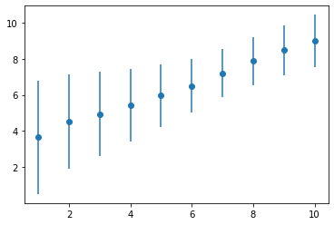

# 第四次大作业 - 评论情感分析

## 实验任务

原始任务如下：

> 请尝试从京东或淘宝网上收集商品的评论语料，并利用这些数据进行句子或文档级的情感类别标注，抽取情感词汇。

## 数据收集

本节代码的实现位于 `data_crawler.py` 中，运行位于 `get_data.ipynb` 中。

### 来源说明

由于京东、淘宝网上充斥着大量水军评论，且反爬虫机制较为严格，经助教同意后，我选择改为从 [Bangumi](https://bgm.tv) 上收集番剧评论语料作为情感分析的对象。

Bangumi 是一个由 Sai 发起的 ACG 分享与交流项目，设有动画、游戏、书籍、音乐和三次元五大分区。从这个网站上收集语料有下述优势：

- 大部分评论附带评分，可以作为标签用来训练情感分类器；
  避免了人工标注的主观性，同时能收集到更大量级的有标签数据
- 网站知名度相比豆瓣较低，水军评论较少，数据更加真实、质量较高
- 评论大都围绕作品本身，抽象程度较低，更适合作为情感分析的对象
- 网站反爬虫机制较弱，只需简单的 header 伪装即可爬取，无需使用代理 ip

### 爬虫实现

爬虫使用 Python 语言编写，使用 requests 库进行网络请求，使用 BeautifulSoup 库进行 HTML 解析。

下面将对爬虫的实现做简要介绍。

#### 爬取一个网页

由于使用 requests 库向同一网站发送过多请求时会遇到超时错误，因此我实现了简单的重试机制：当请求失败时，会等待 1 秒后再次尝试，直到请求成功为止。

```python
def url_to_html(url):
    while True:
        try:
            r = requests.get(url, headers=get_headers())
            break
        except Exception as e:
            print(e)
            time.sleep(1)
    
    r.encoding = "utf-8"
    return r.text
```

需要额外注意的是，为了避免乱码，需要将 requests 的返回值编码设置为 utf-8。

#### 爬取一个页面的所有评论

Bangumi 的评论分页显示，需要逐页爬取。下面是爬取一个页面上所有评论的实现。

```python
def subject_to_html(subject_id, page_id=1):
    url = 'https://bgm.tv/subject/{}/comments?page={}'.format(subject_id, page_id)
    return url_to_html(url)
```

该函数接收两个参数，分别表示待爬取的作品 id 和页码。

#### 解析一个页面的所有评论

使用 BeautifulSoup 库解析 HTML 代码，提取该页面上的所有评论，按照评分 `score` 大小分类存放到字典 `comment_dict` 中。

```python
def html_add_to_comment(html_txt, comment_dict)
```

上述函数用于实现描述的功能，它将在输入的 `comment_dict` 的基础上更新 `html_txt` 中的所有评论数据。当本页面上存在评论时，函数返回 `True`，否则返回 `False`。`True` 与 `False` 的作用是为了判断是否需要继续爬取下一页。

#### 爬取并解析一个作品的所有评论

通过综合上述函数，实现了对一个作品 `subject_id` 下所有评论页面的爬取与解析。

```python
def subject_to_comment(subject_id, comment_dict=None):
    if comment_dict is None:
        if os.path.exists("data/{}.json".format(subject_id)):
            with open("data/{}.json".format(subject_id), "r", encoding="utf-8") as f:
                comment_dict = json.load(f)
        else:
            comment_dict = {}
            for i in range(1, 11):
                comment_dict[str(i)] = []
            comment_dict["page"] = []

    html_txt = ""
    for page_id in range(1, 100):
        if page_id in comment_dict["page"]:
            continue
        html_txt = subject_to_html(subject_id, page_id)
        if html_add_to_comment(html_txt, comment_dict):
            comment_dict["page"].append(page_id)
            print("page", page_id, "done")
        else:
            break
    print("last:")
    print(html_txt)
    return comment_dict
```

为了实现断点续传，我将已爬取的页面也一并记录在了 `comment_dict` 中，作为 `"page"` key 对应的值。当爬取到一个已爬取过的页面时，会跳过该页面，继续爬取下一页。

#### 爬取作品列表

作品列表中应记录所有待爬作品的 `subject_id` 。一种获取作品列表的简单方式是取若干个随机数，视作 `subject_id` ，但这种方式得到的作品大都比较冷门，缺少足够的评论数据，效率过差。

最合适的方式是按照作品的热度排序，从热门作品开始爬取。但是 Bangumi 本身没有提供按热度排序的功能，只能按评分排序。然而，爬取按评分排序的作品列表会导致收集到的语料聚集于高评分段，不再具有代表性。

最后，我选择爬取我的个人收藏夹。这样保证了爬取到的作品不会过于冷门，同时也方便实验结果与我的个人印象进行对比。

由于每次最多只能获取 50 个作品的 id，因此需要多次爬取，直到爬取到所有作品为止。

```python
def subject_id_add_to_list(offset, subject_id_list):
    url = "https://api.bgm.tv/v0/users/600270/collections?limit=50&offset={}".format(offset)
    json_txt = url_to_html(url)
    print(json_txt, end="")
    json_dict = json.loads(json_txt)
    if "data" in json_dict.keys():
        subject_id_list += [x["subject_id"] for x in json_dict["data"]]
        return True
    else:
        return False

def get_subject_id_list():
    subject_id_list = []
    offset = 0
    while subject_id_add_to_list(offset, subject_id_list):
        print("offset", offset, "done")
        offset += 50
    return subject_id_list
```

### 数据信息

共爬取到 290 个作品，按照 `subject_id` 为文件名以 json 格式存储在了 `data` 文件夹下。此外，同目录下的 `subject_id_list.json` 文件记录了所有爬取到的作品的 `subject_id` 。

## 问题分析

每条评论语料可以看做输入，其对应的评分可以看做标签。评分越高一般表示更加正面的情感，评分越低一般表示更加负面的情感。因此，原始的情感分析问题可以转化为一个评分预测问题。

评分一共有 10 个等级，我们可以将其看做一个回归问题，但是考虑到不同的评分在分布以及语义上并不是等距的（例如“1分”的概率显著高于“2分”，因为前者是最低分，并且往往带有强烈的负面情感），我还是将其作为一个多分类问题处理。

注意到，对评分信息增益最高的特征词往往是情感词汇。因此，原始任务中的情感词汇抽取任务可以看做是一个特征词提取任务。后续实验证明，这样的简化处理在摆脱对语法分析/先验词典等方法的依赖的同时，依旧能取得不错的效果。

## 特征提取

本节代码的实现位于 `feature.py` 文件中，运行位于 `get_feature.ipynb` 文件中。

### 统计词频

```python
def count_words(subject_id_list, data_path="data", n_grams=[1,2]):
    ...
    return words, words_times, comment_num, words_all, comment_num_all
```

在收集到评论数据后，我们需要对所有评论进行分词、统计词频。这里使用了 jieba 库进行分词。

上述函数除了接收作品列表 `subject_id_list` 以外，还接收一个参数 `n_grams` ，用于指定分词的 n 元组。当 `n_grams=[1]` 时，表示按词为单位统计；当 `n_grams=[1,2]` 时，表示不仅统计词频，还统计所有二元组词频率。一个典型的例子是：当 `n_grams=[1]` 时，“艺画开天”这个短语将别识别成两个词“艺画”与“开天”；然而当 `n_grams=[2]` 时，“艺画”“开天”“艺画开天”这三个词都将被统计。

二元组和一元组（以及其他 `n_grams` 中包含的 i 元组）仅在分词时做区分，后续处理中一视同仁，统一用“词汇”一词指代。

该函数主要统计下述量并作为返回值返回：

- `words`：对于每个分数，统计该分数下所有出现指定词汇的评论数量。
- `words_times`：对于每个分数，统计该分数下所有评论中指定词汇的总出现次数。
- `comment_num`：对于每个分数，统计该分数下所有评论的数量。
- `words_all`：对于每个词汇，统计所有出现该词汇的评论数量。
- `comment_num_all`：统计评论总数。

这部分的结果保存在所有以 `output` 开头的文件夹中，文件夹的后缀用于标记被统计的词汇来源。

### 估算概率

```python
def estimate_p(words, words_times, comment_num, words_all, comment_num_all):
    ...
    return p_c, p_c_t, p_c_nt
```

该函数主要利用上一步统计到的词频信息，估算下述五个概率的值。这些值主要用于后续信息增益的计算。

- `p_c`：$p(c_j)$，表示分数为 $c_j$ 的评论的概率。
- `p_c_t`：$p(c_j|t_i)$，表示包含词汇 $t_i$ 的评论的分数为 $c_j$ 的概率。
- `p_c_nt`：$p(c_j|\overline{t_i})$，表示不包含词汇 $t_i$ 的评论的分数为 $c_j$ 的概率。
- `p_t`：$p(t_i)$，表示评论中包含词汇 $t_i$ 的概率。
- `p_nt`：$p(\overline{t_i})$，表示评论中不包含词汇 $t_i$ 的概率。

前三个概率的计算结果同样保存在以 `output` 开头的文件夹中。后两个概率的计算结果分别保存在 `p_c_t[word]["p_t"]` 和 `p_c_nt[word]["p_nt"]` 中。详见输出文件。

### 计算信息熵与信息增益

```python
def get_h_and_ig(words_all, p_c, p_c_t, p_c_nt):
    ...
    return h_c_t, h_c, ig_c_t
```

该函数主要根据下述公式：

$$\begin{aligned}
H\left(C \mid T_i\right) & =p\left(t_i\right) H\left(C \mid t_i\right)+p\left(\overline{t_i}\right) H\left(C \mid \bar{t}_i\right) \\
& =-p\left(t_i\right)\left(\sum_{c_j} p\left(c_j \mid t_i\right) \log p\left(c_j \mid t_i\right)\right)-p\left(\bar{t}_i\right)\left(\sum_{c_j} p\left(c_j \mid \bar{t}_i\right) \log p\left(c_j \mid \bar{t}_i\right)\right)
\end{aligned}$$

利用上一步估算到的概率信息，计算下述三个量的值。

- `h_c_t`：$H(C|T_i)$，表示在知道评论中是否包含词汇 $t_i$ 的条件下，评分的信息熵。
- `h_c`：$H(C)$，表示评分的信息熵。
- `ig_c_t`：$IG(C,T_i)$，表示特征词 $t_i$ 对评分的信息增益。

信息增益的计算结果同样保存在以 `output` 开头的文件夹中。这里展示信息增益 TOP 100 词汇。

```plain
"神作": 0.010274817525304902,
"不错": 0.0081543868199081,
"还": 0.007412007515161134,
"还行": 0.006358019022003836,
"！": 0.005474973503995173,
"答辩": 0.00532895009626122,
"很": 0.004864781032022147,
"有点": 0.004735676571542724,
"挺": 0.004643364386441418,
"无聊": 0.004588306850645152,
"完美": 0.0042097191867749295,
"还是": 0.00399748108158815,
"行": 0.003703277486720502,
"的神作": 0.0036725525404026627,
"剧情": 0.003547068755081373,
"没": 0.0034773101492757696,
"恶心": 0.0032207914914783586,
"就": 0.00321027418772335,
"不错，": 0.003181326998611178,
"烂": 0.0031402137591820534,
"最": 0.003024845562063616,
"一般": 0.0029958290951581645,
"不过": 0.0029668998603105123,
"？": 0.0029525490797712717,
"垃圾": 0.0028262060355139784,
"7": 0.002787874424961867,
"作品": 0.002683259478680533,
"感觉": 0.0026678769978230044,
"非常": 0.002599167202232522,
"但": 0.0025787508240107115,
"7.5": 0.0025565211217064565,
"神作，": 0.0025321076387416763,
"8": 0.0025218404370568326,
"还不错": 0.002391658399789609,
"9": 0.0023201301595949797,
"什么": 0.0023181326503733946,
"最喜欢": 0.0023082292240896862,
"神": 0.0022171445950174284,
"依托答辩": 0.002210582092399882,
"不": 0.002196920192308438,
"优秀": 0.0021956973907695243,
"依托": 0.002150824862251044,
"啥": 0.0021344744395999093,
"满分": 0.002126033261540483,
"10分": 0.002071598238638561,
"一坨": 0.0020703845905150065,
"屎": 0.0020601477695649795,
"心中": 0.002039193962782404,
"不错的": 0.002028741360489583,
"莫名其妙": 0.0020287048685436737,
"6.5": 0.0020272253672184437,
"巅峰": 0.0020126562189446418,
"吧": 0.002011317827929071,
"完美的": 0.002004228827778398,
"，不过": 0.0019943422907806596,
"不如": 0.001989242988071682,
"喜欢": 0.0019432630335187717,
"的作品": 0.001942683130491396,
"设定": 0.001935812597853026,
"行，": 0.0019290154666244952,
"8.5": 0.0019270135249869202,
"比较": 0.0018203562484055968,
"人生": 0.0018081055349272734,
"，但": 0.001790147396461883,
"6": 0.001784625707516696,
"永远": 0.0017665185088666657,
"的": 0.0017596087823241735,
"看不下去": 0.0017517493163847764,
"震撼": 0.001734485412800968,
"观感": 0.0017291861654014085,
"还可以": 0.001714213580321866,
"不行": 0.001692778165704567,
"人设": 0.0016800220326813609,
"也就": 0.0016767495468499316,
"！！": 0.0016766545957267454,
"p9": 0.0016706230053127324,
"后面": 0.0016488829313410225,
"7分": 0.001647400941760857,
"浪漫": 0.0016384548349932526,
"但是": 0.0016269069198988628,
"玩意": 0.0016266248442453612,
"9分": 0.0016226848166547292,
"有些": 0.0016136781600262218,
"还算": 0.0016120812899942383,
"…": 0.0016100570685237958,
"三体": 0.0016077746387053171,
"一部": 0.0015641374398822627,
"天花板": 0.0015540386251138294,
"女主": 0.001547174523723216,
"的，": 0.0015351909379217599,
"之一": 0.0015214337158817592,
"与": 0.0015119490125117263,
"弃": 0.0014966486492122844,
"，": 0.0014962274694363398,
"总体": 0.0014797693712009785,
"8分": 0.0014779509891407194,
"好": 0.0014635035294208176,
"神中神": 0.0014514164897170279,
"治愈": 0.001444464724976946,
"心目": 0.0014396693428631036,
```

可以看到，绝大部分（尤其是头部）的词汇确实如假设的那样包含了某种情感色彩，同时对评分也有较大的影响。（不过还是混入了一些奇怪的东西，比如“p9”... “三体”。两者在对评分的概率贡献如下：

```plain
"p9": {
    "1": 0.055776892430278883,
    "2": 0.10358565737051793,
    "3": 0.18725099601593626,
    "4": 0.3107569721115538,
    "5": 0.1593625498007968,
    "6": 0.15139442231075698,
    "7": 0.01593625498007968,
    "8": 0.01593625498007968,
    "9": 0.0,
    "10": 0.0,
    "p_t": 0.0009940397219857032
}

"三体": {
    "1": 0.3405994550408719,
    "2": 0.05722070844686648,
    "3": 0.051771117166212535,
    "4": 0.04087193460490463,
    "5": 0.021798365122615803,
    "6": 0.01634877384196185,
    "7": 0.07901907356948229,
    "8": 0.2016348773841962,
    "9": 0.1335149863760218,
    "10": 0.05722070844686648,
    "p_t": 0.0014534365656125622
}
```

这恰恰体现了当下网络环境热衷将高期待、低质量的作品拿来对比的现象——这何尝不是一种情感词汇（）

## 朴素贝叶斯分类器

信息增益除了可以用来识别情感词汇，还可以进一步筛选特征词。从而我们可以将高达百万量级的词汇量（有这么多是因为里边还包含了二元组）降低到一万量级，以供后续训练分类器。

这里，我手动实现了一个朴素贝叶斯分类器。实现部分的代码详见 `naive_bayes.py`，运行部分的代码详见 `pred.ipynb`。

### 统计非特征词词频

由于我只使用了100000个词汇作为特征词，剩下的词汇将被归为一类，用“<UNK>”代替。这里我统计了一下这些词汇的词频，在后续处理中“<UNK>”也同样被视作一个特征词。

```python
# count feature words times
feature_words = list(ig_c_t.keys())[:feature_words_num]
not_feature_words = list(set(words_all.keys()) - set(feature_words))
self.vocab = feature_words + ["<UNK>"]
feature_words_times = {}
for i in range(1, 11):
    feature_words_times[str(i)] = {word: words_times[str(i)].get(word, 0) for word in feature_words}
    feature_words_times[str(i)]["<UNK>"] = sum([words_times[str(i)].get(word, 0) for word in not_feature_words])
```

### 估算概率

需要估算的概率为 $p(t_i|c_j)$，即在类别 $c_j$ 中出现词汇 $t_i$ 的概率。这里我使用了拉普拉斯平滑，即

$$
p(t_i|c_j) = \frac{count(t_i, c_j) + 1}{count(c_j) + |V|}
$$

相应代码如下：

```python
# get p(t|c)
self.p_t_c = {}
for word in self.vocab:
    self.p_t_c[word] = {}
for i in range(1, 11):
    for word in self.vocab:
        self.p_t_c[word][str(i)] = 1 + feature_words_times[str(i)][word]
    tot = sum(self.p_t_c[word][str(i)] for word in self.vocab)
    for word in self.vocab:
        self.p_t_c[word][str(i)] /= tot
```

这个概率的计算结果同样保存在以 `output` 开头的文件夹中，文件名带有前缀“NB”，为朴素贝叶斯分类器的英文缩写。

### 预测

预测的过程就是计算 $p(c_j|x)$，代码如下：

```python
def predict(self, text, prt=False):
    str_words = []
    for n_gram in self.n_grams:
        str_words += jieba_cut(text, n_gram)
    str_words = [word if word in self.vocab else "<UNK>" for word in str_words]
    if prt:
        print(str_words)

    log_pred = {}
    for i in range(1, 11):
        p = math.log(self.p_c[str(i)])
        for word in str_words:
            p += math.log(self.p_t_c[word][str(i)])
        log_pred[str(i)] = p

    pred = {}
    for i in range(1, 11):
        pred[str(i)] = 1 / sum([math.exp(log_pred[str(j)] - log_pred[str(i)]) for j in range(1, 11)])
    
    return pred
```

需要额外注意的是，原始公式采用了累成的计算方式，这样容易导致概率消失，尤其是当评论字数过长时。为了解决这个问题，我改成了再对数空间下累加的计算方式。在得到最后的预测概率时，需要经过一次指数运算并归一化。

### 情感词抽取

这里假设情感词为对最终类别选择贡献较大的词汇。

根据上述假设，我实现了下述代码为所有词汇计算了情感权重，并按从大到小的顺序打印出来。

```python
def get_emotional_words(self, text, pred_max, prt=False):
    str_words = []
    for n_gram in self.n_grams:
        str_words += jieba_cut(text, n_gram)
    str_words = [word if word in self.vocab else "<UNK>" for word in str_words]
    
    emotional_words = {}
    for word in str_words:
        emotional_words[word] = math.log(self.p_t_c[word][str(pred_max)]) - \
            sum([math.log(self.p_t_c[word][str(i)]) for i in range(1, 11)])
    emotional_words = sorted(emotional_words.items(), key=lambda x: x[1], reverse=True)
    
    if prt:
        print("emotional words weight:", emotional_words)

    return emotional_words
```

## 实验结果

在 `pred.ipynb` 中，我从数据集中随机挑选了200个作品的评论，进行了预测。并按照评分真值对分类器的预测值进行了统计，得到了如下的统计结果：

```python
mean error: 1.0233019496886027
score: 1 pred_count: [('1', 1229), ('8', 254), ('6', 203), ('4', 143), ('7', 140), ('5', 115), ('10', 115), ('9', 65), ('3', 47), ('2', 24)]
score: 2 pred_count: [('2', 178), ('1', 175), ('6', 148), ('5', 125), ('8', 125), ('4', 122), ('7', 99), ('3', 38), ('10', 27), ('9', 19)]
score: 3 pred_count: [('3', 412), ('6', 328), ('5', 258), ('8', 226), ('1', 198), ('4', 198), ('7', 197), ('10', 51), ('9', 45), ('2', 39)]
score: 4 pred_count: [('4', 1223), ('6', 975), ('5', 583), ('7', 569), ('8', 462), ('1', 270), ('10', 120), ('9', 106), ('3', 89), ('2', 73)]
score: 5 pred_count: [('5', 2431), ('6', 2414), ('7', 1723), ('8', 1182), ('4', 630), ('1', 300), ('10', 239), ('9', 238), ('3', 174), ('2', 90)]
score: 6 pred_count: [('6', 8124), ('7', 6329), ('8', 3782), ('5', 1908), ('4', 962), ('9', 702), ('10', 604), ('1', 346), ('3', 250), ('2', 113)]
score: 7 pred_count: [('7', 16640), ('8', 12146), ('6', 6370), ('9', 2398), ('10', 2066), ('5', 1464), ('4', 704), ('1', 369), ('3', 139), ('2', 92)]
score: 8 pred_count: [('8', 24318), ('7', 10188), ('9', 6799), ('10', 5240), ('6', 3067), ('5', 861), ('4', 461), ('1', 369), ('3', 116), ('2', 75)]
score: 9 pred_count: [('8', 9391), ('9', 9024), ('10', 6572), ('7', 2622), ('6', 887), ('5', 363), ('1', 235), ('4', 186), ('3', 53), ('2', 48)]
score: 10 pred_count: [('10', 9822), ('8', 4203), ('9', 3053), ('7', 887), ('6', 419), ('5', 172), ('1', 167), ('4', 105), ('3', 26), ('2', 20)]
```

上述输出中，`score` 表示真实评分，`pred_count` 表示真实评分为 `score` 的评论在预测中被预测为各个评分的次数。

其中 `mean error` 表示评分与真值的差值的期望。可以看到，平均误差为1.02，这个结果还是比较优秀的。同时，对于绝大部分评分，朴素贝叶斯分类器均能给出相近的分数。

我也对预测结果的统计量进行了可视化，如下图所示：



其中横坐标表示评分的真值，纵坐标表示朴素贝叶斯分类器的打分。可以看到，朴素贝叶斯分类器的打分与真值呈正相关，均值严格单调上升。虽然打分并未完全位于对角线上，但考虑到低分段和高分段在这类统计方法下必定有向中心靠拢的趋势，这个结果还是比较令人满意的。

这里我也选取了一些不在训练数据集中的评论的预测结果，如下所示：
（按时间顺序选择最近的若干评论）

```
# https://bgm.tv/subject/115660/comments
# 命运石之门 聪明睿智的认知计算

真心挺无聊的
emotional words weight: [('挺无聊', 103.2347845403317), ('无聊的', 86.97061265618946), ('无聊', 71.70302094017225), ('挺', 68.16724085906198), ('的', 32.31618642609281), ('<UNK>', 7.243542237680459)]
score prediction by max: 5
score prediction by expectation: 5.297760022640105
ground truth: 4

命运石之门广告短片
emotional words weight: [('命运石之门', 104.39873717872229), ('石之门', 104.28259752880963), ('短片', 103.81845901901629), ('命运', 92.87985829741193), ('广告', 92.3887807182417), ('<UNK>', 7.2458332124158735)]
score prediction by max: 10
score prediction by expectation: 9.43534722729431
ground truth: 6
注：朴素贝叶斯分类器貌似把“命运石之门”当作了高分关键词。

意外得还蛮有意思的小短片合集，助手的技术力上大分。
emotional words weight: [('，助手', 111.18757407435706), ('蛮有意思的', 108.70266742456906), ('得还', 106.55868736175165), ('蛮有意思', 106.09178097192051), ('短片', 104.44233772487269), ('助手', 97.37221852840652), ('的小', 93.8846840891956), ('意外', 88.26386489080802), ('小', 76.31018108038893), ('得', 63.70943104676967), ('还', 56.995442883886675), ('。', 38.81877879294647), ('的', 32.43661764665258), ('，', 30.355891784064863), ('<UNK>', 7.241824284147688)]
score prediction by max: 7
score prediction by expectation: 7.287094498062026
ground truth: 7

玩梗泡面
emotional words weight: [('泡面', 103.46249275745853), ('梗', 86.6867420021607), ('玩', 81.47809762057305), ('<UNK>', 7.2376559585684666)]
score prediction by max: 6
score prediction by expectation: 6.290979277989749
ground truth: 7

机器人跟着一起笑的时候我没绷住
emotional words weight: [('我没', 94.63857071963524), ('一起', 78.68868454665132), ('笑', 75.92439954736946), ('的时候', 73.71725353073714), ('时候', 70.6623670543828), ('没', 59.846453821438075), ('我', 47.06884435835538), ('的', 32.51436518341215), ('<UNK>', 7.256477154541497)]
score prediction by max: 8
score prediction by expectation: 7.371859210907411
ground truth: 7

还挺有意思的
emotional words weight: [('挺有意思', 94.92244420562656), ('有意思的', 90.60750053523311), ('还挺', 86.46493069060345), ('有意思', 80.25150082316517), ('挺', 68.64048652523854), ('还', 56.995442883886675), ('的', 32.43661764665258)]
score prediction by max: 7
score prediction by expectation: 6.826766331675566
ground truth: 7

补评
emotional words weight: [('<UNK>', 7.256477154541497)]
score prediction by max: 8
score prediction by expectation: 7.3411287964628436
ground truth: 7

几个小短片，有点无聊了
emotional words weight: [('短片', 105.05189944504144), ('有点无聊', 97.73071088830197), ('无聊了', 95.16536145081909), ('，有点', 88.65268407697927), ('几个', 79.38366625534731), ('小', 76.27478500313377), ('无聊', 71.2705091820131), ('有点', 65.71148644068361), ('了', 40.56820239320825), ('，', 30.361105667699597), ('<UNK>', 7.2376559585684666)]
score prediction by max: 6
score prediction by expectation: 5.815764578000738
ground truth: 6

甜甜的日常十分治愈
emotional words weight: [('治愈', 84.29114452458155), ('十分', 78.95833900014357), ('日常', 72.27953627838059), ('<UNK>', 7.256477154541497)]
score prediction by max: 8
score prediction by expectation: 8.428031673935374
ground truth: 7

6.8
emotional words weight: [('6.8', 110.10388743590562)]
score prediction by max: 7
score prediction by expectation: 6.511993786170877
ground truth: 7
```

每条评论包含了两个打分，其中第一个来自于概率最高的分数类别，第二个来自于各个分数类别按概率加权的期望。可以看到，对于绝大部分有意义/内容丰富的评论，模型的预测结果还是比较较贴合真值的。

